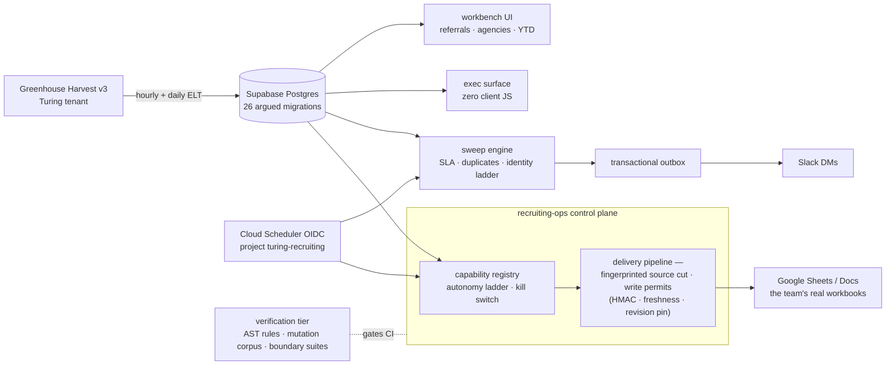

# Recruiting Analytics Platform

**Built by Sam Vangelos.** Greenhouse-to-Postgres ELT, SLA sweeps, identity resolution, a permit-gated Google Workspace write pipeline, and executive dashboards — running against Turing's own recruiting stack.

Recruiting operations here ran the way they run most places: someone pulled Greenhouse into spreadsheets on a cadence, by hand, and the team ran on those spreadsheets. That pipeline drifts, breaks quietly, and concentrates in one person's head. The usual replacement — a dashboard nobody opens — fails the other way, by moving the numbers away from where recruiters actually work. This platform takes a third path. It automates the pull end to end, and it writes the results back *into the team's existing Sheets and Docs* under write permits, so the artifacts people already trust keep updating without a human in the loop.

This repository is the documented carve of that system for internal readers. The live product repo is `Turing-Recruitment/ta-ops-analytics`; this is the same system, presented so a colleague can read it. If you do not have Greenhouse access, the sections below still stand on their own — the ATS is a source of records about jobs, candidates, applications, and the recruiters who own them, and everything here is downstream of that.

---

## Shape

The system is built in three concentric layers.

The **surface** is a thin Next.js App Router app — nine dashboard routes and thirty-five HTTP handlers — that holds no business logic. Operator-facing workbench views for referrals, agencies, and year-to-date figures render from Postgres; the executive state-of-play surface renders server-side with zero client JavaScript.

The **domain** lives in `lib/` across 141 modules: the ELT that pulls Greenhouse Harvest v3 into Postgres on hourly and daily schedules, SLA sweeps over the result, an identity-resolution ladder for recruiters and agencies, a transactional notification outbox that lands in Slack DMs, and the recruiting-ops control plane — twenty-six capability modules and the delivery pipeline that hydrates governed Google Workspace artifacts.

The **verification tier** treats the first two layers as its subject: an AST architecture checker with a behavioral suite proving each rule actually fires, boundary suites that spawn subprocesses over the real repository, a mutation corpus proving the suites bite, and a quarantined red-spec runner for audited-but-unfixed behavior.



The scheduled lanes run on the cadence declared in `vercel.json`: the referral sweep hourly, the agency sweep every four hours, year-to-date extraction daily at 06:30 UTC, identity reconciliation daily at 06:00 UTC, and the notification drain at fifteen minutes past every hour.

---

## Writing into someone else's spreadsheet, safely

The riskiest thing this system does is mutate live documents the recruiting team runs on. The delivery pipeline is built around that risk.

Every write travels under a structural write permit: an HMAC-signed grant naming the exact target, pinned to a document revision, expiring on freshness. The source data is cut and fingerprinted before planning, so what was approved is what gets written; a revision that moved between plan and write voids the permit rather than clobbering someone's edit. Recurring sheets carry rollover lifecycles, so a pipeline rollover recognizes its own finished work instead of re-running it, and the ELT document writer can insert a missed week anywhere in the governed archive, certify the post-image, and roll it back.

Capabilities climb an autonomy ladder — shadow mode first, writing nothing while recording what it would have written, then trust periods, then autonomy — with a kill switch above all of it. Several capabilities ship dormant on purpose: `RECOPS_SHADOW_ENABLED`, `RECOPS_EXEC_ENABLED`, and the notification send path all default off. That is the deployment posture, not unfinished work; each turns on deliberately, per environment, after its trust period.

The registries encode the actual migration. The `T##`, `Q##`, and `S##` identifiers map the inherited inventory of hand-kept workbooks this team ran on — the Rahul Bora daily report, the Power BI RLS coordination with iFour, the duplicate-candidate review queue — and the control plane replaces them artifact by artifact, each deliverable bound to a governed write target with parity checks against the legacy copy it retires. The recruiter roster in `lib/recruiting-ops/dimensions/config/recruiter-team-hod.v1.ts` is the real one: 35 recruiters across the six pods led by Darshan Chauhan, Leah Thornton, Luke Chilkotowsky, Sam Vangelos, Bob, and Vinisha Panwar, transcribed from the `CASE WHEN` statements that recurred across the handover queries. A recruiter not on that list resolves to an explicit defect rather than a sentinel bucket.

---

## Sweeps, identity, and honest alerts

The sweep engine reads the pipeline the way an operations lead would: which referrals are aging toward their SLA, which agency submissions collided with existing candidates, which duplicates need a human decision. Alerts route through a transactional outbox to Slack DMs, deduplicated per recipient and reason, so a retry cannot double-ping and a failed DM to one recruiter cannot drop another's. Unroutable alerts fall back to the head of TA (`U07RJJ6RLN6` in `lib/sweep-config.ts`).

Four production incidents are written into this code, each with its measurement.

The referral sweep originally fetched only applications created in the last 48 hours while the breach threshold was also 48 hours, so an application aged out of the fetch at the moment it crossed into breach and the breach tier was structurally unreachable — zero breach rows across 12,002 `sweep_items`. The census fetch closed it by asking for every active referral in Application Review on an open job, any age.

That census then had to be scoped. Asking Greenhouse for `status` plus `stage_name` without a job filter makes it walk the tenant's entire application id range, and it answers with a gateway timeout and a 503 after roughly 28 seconds. Measured on 2026-08-18, the unscoped query failed four of four trials while the same query scoped to the 51 open job ids succeeded four of four in 1.5 to 3.7 seconds. The unscoped form had driven the referral sweep from a 0% to a 96% daily failure rate over six days, including a 30-hour silence between 16:00 UTC on 2026-08-16 and 21:00 UTC on 2026-08-17. Scoping is also strictly less work: 1,681 of the 1,728 sitting referrals on the 2026-08-12 census sat on closed requisitions and were thrown away client-side.

Departed owners are excluded from routing, per Sam's rule of 2026-08-14 that nobody who has left the company should be messaged. A deactivated user still seated as a Recruiter was producing DMs addressed to someone who had gone, and because unreachable recipients fall back to the head of TA, those copies landed on him. The same evidence gap ran through identity resolution, where 38 applications had been attributed to people who had left. A user id absent from the fetched map is treated as active, because a missing record is not evidence of departure.

Identity resolution itself runs on a ladder — exact id, then email, then constrained name matching — because Greenhouse lists the same human under different identities across endpoints. A wrong merge is worse than an unresolved one, so unresolved rows surface as defects instead of landing silently in a sentinel bucket.

---

## The verification tier

This is the part of the repository that took the most engineering judgment, and it gates everything else in CI.

The architecture checker (`npm run check:recruiting-ops-architecture`) is an AST-level rule engine over the real codebase — module boundaries, forbidden imports, fingerprints over the write path. It reports the file count it examined, currently 160 implementation files, so a run that passed emptily is visible rather than silent. It ships with a behavioral suite that mutates a scratch copy of the repo to prove every rule actually fires, because a rule that cannot fail is decoration.

The mutation corpus (`npm run test:mutation`) seeds known-bad edits and requires that an existing test catch every one. All eight seeded mutations are caught, none survive, and none produce a false kill. It answers the question a green board cannot, which is whether the suite would notice.

The boundary suites derive their file set from `git ls-files` and spawn subprocesses over the repository itself, so they verify the tree as committed rather than a mocked image of it. They need a real git working tree; a tarball export would pass emptily, which is why CI runs them after checkout.

The red-spec quarantine (`npm run test:red`) holds specs for audited behavior that is not yet fixed. CI asserts that the red suite currently fails by assertion — a red spec that passes means the fix landed and the spec moves to the green board, and one that fails to load is a build error. An empty backlog is the goal state, and it has been reached: every audited population was fixed and its spec promoted.

Each alert policy in `docs/recruiting-ops/monitoring/` is checked in beside the outage it closes. One of them documents the scheduler-authorization defect in which every route compared the short Cloud Scheduler job id against the full resource path, so the scheduled hydration run was rejected with HTTP 400 on its only lifetime fire and had never once started. The fix accepts both forms, and the test now supplies the shape production actually sends.

---

## Stack

| Layer | Choice |
|---|---|
| Runtime | Node 24, TypeScript strict, Next.js App Router, React 19 |
| Data | Supabase Postgres (project `ilkbfyubwvbpsevybsfe`), 26 hand-written SQL migrations with argued headers, no ORM |
| External | Greenhouse Harvest v3 (OAuth2), Google Sheets/Docs/Drive, Slack Web API, Resend |
| Scheduling | Cloud Scheduler with OIDC service-account verification in GCP project `turing-recruiting`, region `us-west1`; shared-secret fallback for local runs |
| Deploy | Dockerfile → Cloud Run (standalone output); Vercel for the app surface and its crons |
| Tests | Vitest, plus the architecture checker, mutation corpus, boundary suites, and red-spec runner |

Scheduled endpoints verify the caller twice: the OIDC token's service-account identity against a pinned expectation, and the environment's declaration against the same compiled constant, so deploying a fork means editing both on purpose. The service accounts in play are `ta-ops-analytics-run`, `ta-ops-hydrator-run`, `ta-ops-hydration-scheduler`, `ta-ops-ref-report-scheduler`, `ta-ops-ref-watchdog-scheduler`, and `recops-sheets-writer`, all under `turing-recruiting.iam.gserviceaccount.com`.

Referral reports carry pre-payroll compensation data, so the recipient gate in `lib/recruiting-ops/employee-referral-report-runner.ts` accepts `@turing.com` addresses only, and requires two distinct corporate recipients before it will prepare a delivery.

---

## Running it

```bash
npm ci
cp env.example .env.local   # Supabase, Greenhouse, Slack, Google credentials
npm run dev
```

Migrations live in `supabase/migrations/` and apply in filename order with the Supabase CLI (`supabase db push`) or any SQL runner. The whole verification tier runs on a fresh clone with no credentials configured at all:

```bash
npm run typecheck
npm test                                  # green board, excludes test/red
npm run check:recruiting-ops-architecture
npm run test:mutation
npm run test:red                          # must fail by assertion when non-empty
```

On a clean install that produces 1,895 passing tests across 197 files, 160 files checked by the architecture rules, and 8 of 8 seeded mutations caught. `npm run lint` is not a CI gate and does not currently pass: 21 of its 22 errors are `react-hooks/rules-of-hooks` firing on `scripts/build-exec-css.mjs`, a plain Node build script the rule has no business inspecting, and the twenty-second is a real `react-hooks/purity` finding at `app/(exec)/state-of-play/page.tsx:484`, where `Date.now()` is called during render to compute a staleness flag. The gates that do run are listed in `.github/workflows/ci.yml`.

---

## Status

The platform runs in production against Turing's live Greenhouse tenant. The ELT, the sweeps, referral reporting, the exec surface, and the permit-gated delivery pipeline all operate on real hiring data on a schedule. This repository is a single-commit internal cut of that system with real tenant identifiers, real requisition ids, the real roster, and the real artifact registry left intact. It carries no candidate personal data: the code handles candidate records at runtime, but nothing committed here contains any.
