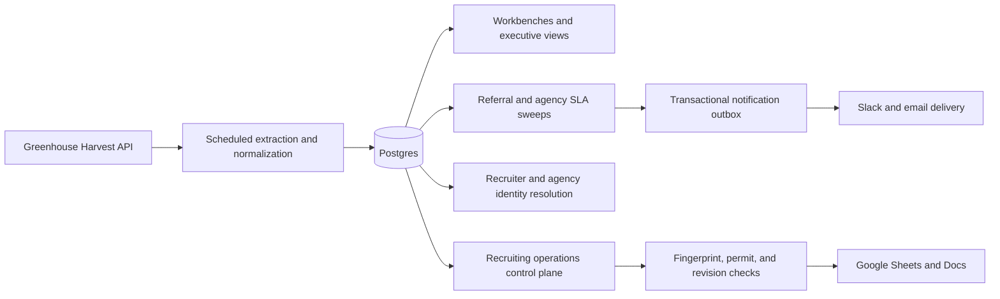

# Recruiting Analytics Platform

This is a Greenhouse-to-Postgres recruiting operations platform. It powers operational dashboards, SLA sweeps, identity resolution, notification delivery, and permit-gated updates to governed Google Workspace artifacts.

This repository is a curated snapshot of the system as of 21 August 2026.

## Current execution path



The Next.js application serves the workbenches, executive views, API routes, and scheduled entrypoints. Domain logic lives in `lib/`; Postgres holds normalized source data, sweep history, identity decisions, delivery state, and the notification outbox.

Greenhouse is a read source. Candidate-impacting ATS actions are not part of this system.

## Operational surfaces

- Referral tracking with SLA state, ownership, and resolution history
- Agency-submission tracking and duplicate detection
- Year-to-date recruiting views
- Server-rendered state-of-play reporting
- Recruiting operations capability and delivery consoles

The active recurring routes and their cadence are declared in [vercel.json](vercel.json). They run referral and agency sweeps, incremental year-to-date extraction, identity reconciliation, and notification draining.

## Delivery controls

Google Workspace writes go through a single governed delivery path. Before a write, the system:

1. cuts and fingerprints the source data;
2. issues an HMAC-signed permit for a specific target;
3. pins the target document revision and permit freshness;
4. applies the planned mutation;
5. certifies the resulting document state; and
6. records enough state to roll the delivery back when the adapter supports it.

A changed revision or stale permit stops the write. Delivery capabilities begin disabled or in shadow mode, and external sends remain off until their environment gates are enabled. A global kill switch can stop automated delivery.

## Identity and notifications

Recruiter and agency identities resolve through deterministic evidence ladders. Strong identifiers are preferred; constrained name matching is used only after stronger evidence is unavailable. Ambiguous records remain unresolved instead of being silently assigned to a fallback identity. Deactivated owners are excluded from notification routing.

Sweep alerts enter a transactional outbox before delivery. Recipient and reason keys make retries idempotent, while individual delivery failures remain visible without dropping unrelated notifications.

## Repository map

| Path | Responsibility |
| --- | --- |
| `app/` | Next.js views, APIs, scheduled routes, and operator surfaces |
| `lib/` | Greenhouse ingestion, sweeps, identity resolution, notifications, and shared domain logic |
| `lib/recruiting-ops/` | Capability registry, extractors, renderers, governed dimensions, and delivery pipeline |
| `supabase/migrations/` | Ordered Postgres schema history |
| `scripts/` | Operator launchers, architecture checks, and mutation checks |
| `test/` | Green verification board, boundary suites, and quarantined red specifications |
| `docs/recruiting-ops/` | Detailed capability, delivery, and monitoring contracts |

## Run locally

The verified runtime is Node.js 24.

```bash
npm ci
cp env.example .env.local
npm run dev
```

[env.example](env.example) documents the data-plane credentials and the delivery gates. Migrations in `supabase/migrations/` apply in filename order with the Supabase CLI or another PostgreSQL runner.

The production container uses the same Next.js standalone server and webpack build exercised in CI. It also includes the staging-hydration and employee-referral operator launchers.

## Verify

The main verification path requires no live credentials:

```bash
npm run typecheck
npm run check:recruiting-ops-architecture
npm test
npm run test:mutation
npm run build -- --webpack
```

The architecture checker enforces module and write-path boundaries against the tracked repository. The mutation corpus seeds known-bad edits and requires the existing checks to reject each one. Specifications for known unmet behavior live under `test/red/`; CI requires them to fail by assertion until the behavior is fixed and the specification moves to the green board.

No real candidate data belongs in this repository. Tests and committed fixtures use synthetic records.

See [CLAUDE.md](CLAUDE.md) for the detailed engineering invariants and runtime map.
